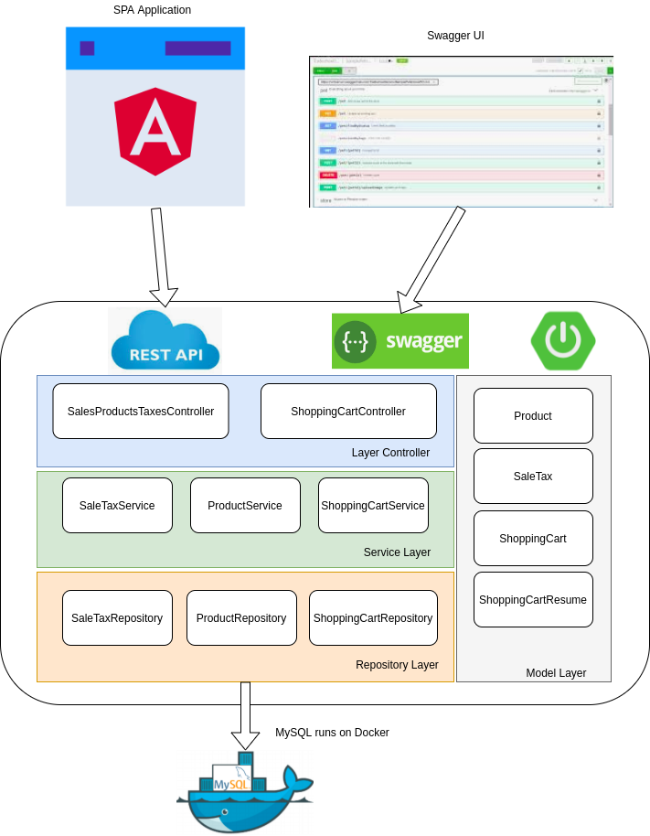
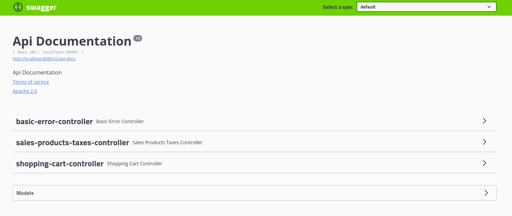
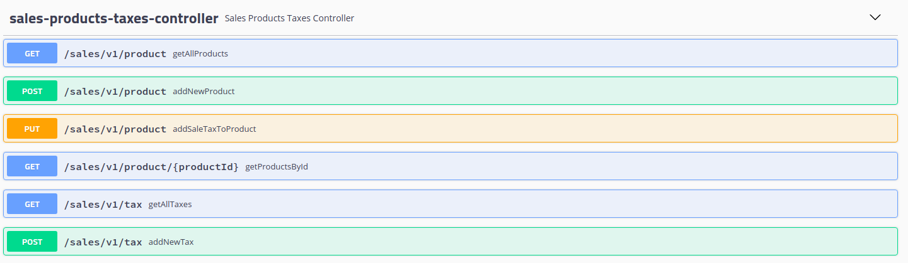
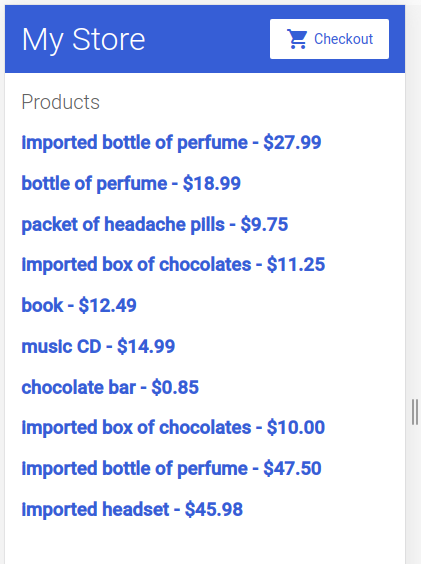
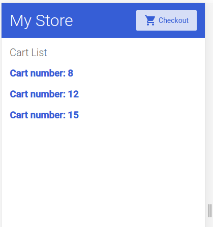
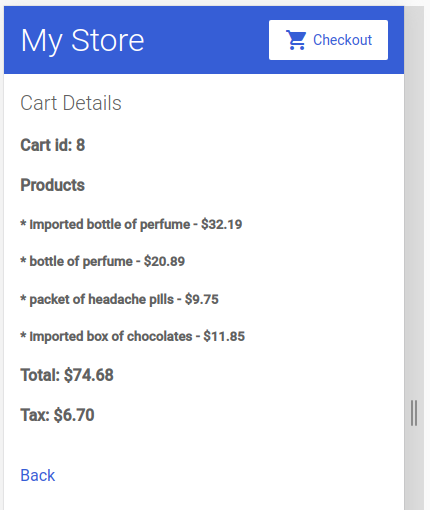

# Compras Online

A aplicação é dividida em 3 partes:

* Aplicação Web
* Backend Java
* Banco de Dados

## Aplicação Web

A aplicação foi escrita em Angular e está disponível no diretório abaixo:

* sales-taxes-web

## Backend Java

O Backend foi escrito em java, utilizando o framework *Spring Boot*. Os serviços são expostos utilizando o padrão REST. A documentação foi escrita no próprio código e, além disso, a documentação dos Controllers foi exposta via Swagger.

Está disponível em:

* sales-taxes-service

## Banco de Dados

O Banco de dados utilizado é o MySQL, em forma de container Docker.

## Visão Geral da Solução

Segue abaixo uma visão geral, de como está estruturada a Aplicação:

* Camada de Aplicação: Composta pela Aplicação Angular e Swagger UI

* Backend: Em Spring Boot, composto pelos módulos(layers) *Controller*, que é responsável por expor as funcionalidades em forma de API. *Service*, que é a camada de serviço consumida pelo controller. *Repository*, camada responsável por fazer a interface com a base de dados. Por fim, a camada *Model*, com todas as entidades utilizadas no backend.

* Camada de dados: A base de dados, já mencionada utiliza um MySQL em docker.

## Execução das Aplicações

A execução deverá seguir a ordem abaixo.

### Banco de dados

Como pré-requisito e necessário ter um docker instalado na máquina.

Estamos subindo a última versão da imagem, mantendo a porta padrão.
~~~
$ sudo docker run -e MYSQL_ROOT_PASSWORD=root -p 3306:3306  -v vol1:/var/lib/mysql mysql
~~~

Se não houver um client do mysql, instalar:
~~~
$ sudo apt install mysql-client
~~~

Após o banco subir, vamos conectar para criar a base e um usuário de Aplicação:
~~~
$ mysql -h 127.0.0.1 -u root -proot

mysql> create database db_sales;
mysql> create user 'serviceuser'@'%' identified by 'servce';
mysql> grant all on db_sales.* to 'serviceuser'@'%';
~~~

### Backend

A Aplicação espera que o banco de dados esteja rodando na mesma máquina, acessando o endereco de loopback (127.0.0.1).

O projeto foi feito utilizando eclipse e maven.

Os fontes estão em: sales-taxes-service

Após compilar, para executar o jar:

~~~
java -jar target/sales-taxes-service-0.0.1-SNAPSHOT.jar
~~~

A Aplicação criara as tabelas dinamicamente. Mas se não forem criadas, se faz necessário alterar a linha abaixo, do arquivo de properties:

Alterar de de
sales-taxes-service/src/main/resources/application.properties
~~~
spring.jpa.hibernate.ddl-auto=update
spring.datasource.url=jdbc:mysql://${MYSQL_HOST:127.0.0.1}:3306/db_sales
spring.datasource.username=serviceuser
spring.datasource.password=servce
~~~

Para:
~~~
spring.jpa.hibernate.ddl-auto=create
spring.datasource.url=jdbc:mysql://${MYSQL_HOST:127.0.0.1}:3306/db_sales
spring.datasource.username=serviceuser
spring.datasource.password=servce
~~~

Lembre-se de voltar a opção update após a criação.

#### Entidades

As seguintes entidades foram criadas, para representar os produtos contidos em um carrinho de compras, e os impostos associados.

* SaleTax - Representa uma taxa. Ela contém os atributos:
    - *percent*: valor aplicado sobre o preço do produto
    - *label*: Identificação da taxa. Exemplo: Import duty tax
    - *description* - Descrição da taxa. Exemplo: Import duty is an additional sales tax applicable on all imported goods at a rate of 5%, with no exemptions

* Product - Representa um produto. Ela contém os atributos:
    - *name*: Nome do Produto. Exemplo: Imported chocolate
    - *price*: Preço do Produto. Exemplo 12.32
    - *saleTaxes*: Lista de taxas aplicáveis ao produto. 

* ShoppingCart - Representa um carrinho de compras. Contém o atributo:
    - *products* - Lista de produtos

* ShoppingCartResume - Resumo de um carrinho. Contém os seguintes atributos:
    - *shoppingCart* - Carrinho de compras com a lista de produtos e taxas, com os preços dos produtos com as taxas incluídas
    - *salesTaxes* - Valor total de taxas somados
    - *total* - Valor total do carrinho

As entidades *SaleTax, Product e ShoppingCart* têm um atributo identificador.
É possível ter uma lista de carrinhos.

#### Controllers

Dois controllers foram criados.

* SalesProductsTaxesController - Responsável por expor a api para manipulação dos produtos e taxas.

* ShoppingCartController - Responsável por expor a api para manipulação dos carrinhos.

#### Services

Camada responsável por provê os serviços de acesso a dados para o Controller.

* ProductService - Serviço para Produtos

* SaleTaxService - Serviço para Taxas

* ShoppingCartService - Serviço para o Carrinho

#### Repository

Camada responsável por abstrair a conexão com a base de dados

* ProductRepository - Crud de Produtos

* SaleTaxRepository - Crud para Taxas

* ShoppingCartRepository - Crud para Carrinho

### Swagger UI

Segue abaixo a URL de acesso ao swagger:
~~~
http://localhost:8080/swagger-ui.html#/
~~~

#### sales-product-taxes-controller
 

As taxas deverão ser cadastradas através desta interface, metodo *addNewTask*.

Exemplos: 

Taxa 01 - Básica
~~~
    percent: 10,
    label: Basic sales tax
    description: Basic sales tax is applicable at a rate of 10% on all goods, except books, food, and medical products that are exempt.
~~~

Taxa 02 - Isento
~~~
    percent 0,
    label: Exempt
    description: Books, food, and medical products that are exempt
~~~

Taxa 03 - Importação
~~~
    percent: 5,
    label: Import duty tax
    description: Import duty is an additional sales tax applicable on all imported goods at a rate of 5%, with no exemptions.
~~~

Após o cadastro das taxas, vamos cadastrar os produtos através do método *addNewProduct*.

Informe o nome e o preco.

Através do método *addSaleTaxToProduct*, faça o relacionamento de uma taxa com um produto (pode ser feito "n" vezes). O Produto pode ter mais de uma taxa.

### shopping-cart-controller

Crie um carrinho em *createShoppingCart*.

Adicione produtos ao carrinho, atraves do método *updateShoppingCart*.

Para ver um resumo do carrinho, utilize o método *getResumeOfShoppingCart*.

### Aplicação Web

Como pré-requisito deve-se ter o *npm* e *Angular* cli instalados.

A aplicação foi desenvolvida na *IDE Visual Studio Code*.

Os fontes estão em: sales-taxes-web

Para instalar os pacotes, executar o comando abaixo dentro da pasta da Aplicação:
~~~
$ npm i
~~~

Para a execução, basta executar o comando abaixo:
~~~
$ ng serve
~~~

Endereço da Aplicação: 
~~~
http://localhost:4200/
~~~

Após os produtos cadastrados:

Listas de Carrinhos de Compras (Clique em Checkout):

Resumo de um Carrinho de Compras (Clique em um item):

